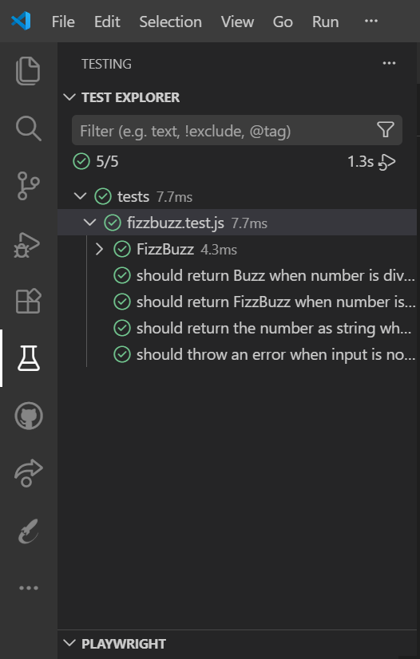
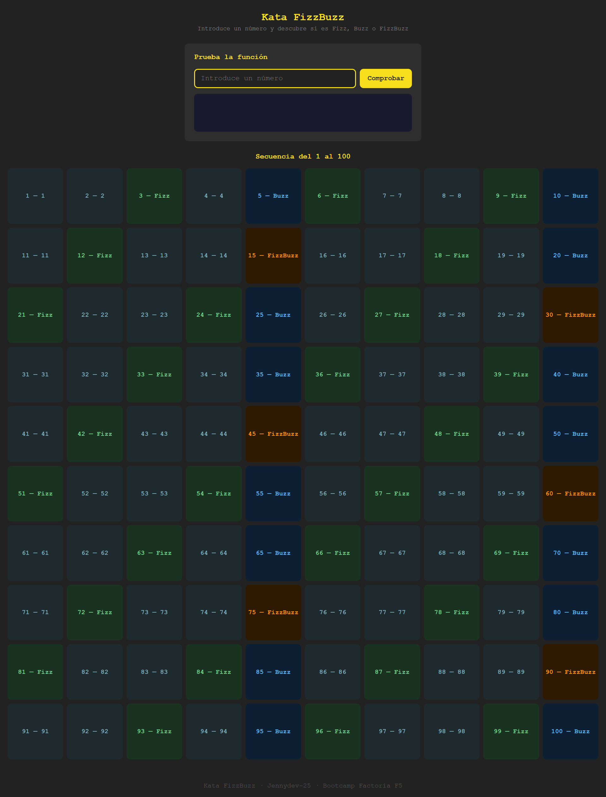

# 🔢 Kata FizzBuzz · Vitest

_"Tu boca se seca, el tiempo se detiene… y finalmente logras decir "Fizz". Has sobrevivido."_

----------

## 📖 Descripción

Este proyecto forma parte de un ejercicio para aprender la lógica de la función **FizzBuzz** mediante TDD (Test-Driven Development) con Vitest.

El reto es escribir un programa que evalúe números aplicando las reglas del juego **FizzBuzz**, cubriendo todos los escenarios con tests unitarios y mostrando el resultado de forma visual e interactiva.

Lo realizaré con **JavaScript**, **Vitest** y **SASS**, aplicando separación de responsabilidades, metodología **BEM**, **Conventional Commits** y **ES Modules**.

----------

## 🔍 Análisis

Antes de escribir código analicé los escenarios del enunciado para identificar los casos de uso de la función principal y los elementos que necesitaría para la interfaz.

**Fase 1 — Casos de uso de `checkNumber(numb)`:**

| Condición | Resultado |
|---|---|
| Divisible por **3** | `"Fizz"` |
| Divisible por **5** | `"Buzz"` |
| Divisible por **3 y 5** | `"FizzBuzz"` |
| No divisible ni por 3 ni por 5 | `"7"` |
| El dato no es un número | ❌ Lanza un `Error` |

**Fase 2 — Análisis visual:**

Antes de programar la interfaz analicé qué elementos HTML necesitaba para construirla:

**Sección 1 — Prueba la función:**

- Un `<header>` con el título del proyecto
- Un `<form>` con un `<input>` numérico y un botón para probar `checkNumber()` con cualquier número
- Una `<section>` que muestra el resultado con su color correspondiente

**Sección 2 — Secuencia completa:**

- Una `<section>` con título explicativo
- Una `<ol>` con las 100 tarjetas generadas automáticamente
- Cada tarjeta es un `<li>` con el número y su resultado (Fizz, Buzz, FizzBuzz o número)
- Un `<footer>` con el mensaje final

----------

## 📐 Planificación

Estructura de archivos decidida antes de programar:

**Fase 1 — Lógica y tests:**

- **`src/js/`** — lógica dividida por responsabilidad:
  - `fizzbuzz.js` → función `checkNumber()`, lógica core
  - `sequence.js` → generador de la secuencia 1-100
- **`main.js`** — entrada por consola
- **`tests/`** → tests unitarios con Vitest
- **`assets/imgs/`** — capturas del proyecto

**Fase 2 — Interfaz visual:**

- **`index.html`** — marcado semántico HTML5
- **`app.js`** — lógica del formulario y renderizado de la secuencia en el DOM
- **`src/sass/`** → estilos modulares con metodología BEM:
  - `styles.scss` → punto de entrada, solo `@use`
  - `_variables.scss` → colores, fuentes y breakpoints
  - `_base.scss` → reset y estilos globales
  - `_header.scss` → estilos del header
  - `_checker.scss` → estilos del formulario y resultado
  - `_sequence.scss` → estilos de las tarjetas
  - `_footer.scss` → estilos del footer
- **`src/css/`** → CSS compilado desde SASS (generado automáticamente)

----------

## 📋 Planificación de commits

**Fase 1 — Lógica y tests (TDD):**

- `docs`: add project README
- `chore`: initialize project with Vitest
- `feat`: add project structure
- `test`: add test for number divisible by 3 returns Fizz
- `test`: add test for number divisible by 5 returns Buzz
- `test`: add test for number divisible by 3 and 5 returns FizzBuzz
- `test`: add test for number not divisible by 3 or 5 returns the number as string
- `test`: add test for non-number input throws error
- `docs`: add test explorer screenshot to README
- `feat`: add sequence generator module
- `feat`: add main.js console entry printing 1 to 100
- `refactor`: extract conditions to readable variables

**Fase 2 — Interfaz visual:**

- `chore`: install and configure sass
- `feat`: add HTML base structure
- `feat`: add app.js DOM renderer
- `docs`: update README with sass commits
- `style`: add SASS variables
- `style`: add base styles and reset
- `style`: add header styles
- `style`: add checker section styles
- `docs`: update README with modular sass structure
- `style`: add sequence section styles
- `style`: add footer styles
- `docs`: add final screenshot to README

----------

## 🧪 Tests

Cinco escenarios **BDD** con patrón **AAA** (Arrange · Act · Assert):

| Escenario | Input | Output esperado |
|---|---|---|
| Divisible por 3 | `3` | `"Fizz"` |
| Divisible por 5 | `5` | `"Buzz"` |
| Divisible por 3 y 5 | `15` | `"FizzBuzz"` |
| No divisible ni por 3 ni por 5 | `7` | `"7"` |
| No es un número | `"hola"` | `Error` |

----------

## 📸 Test Explorer

----------

## 📸 Resultado final

----------

## 🛠️ Tecnologías

- Git & GitHub
- VS Code
- HTML5
- JavaScript ES Modules
- SASS → CSS con metodología BEM
- Vitest

----------

## 🚀 Instalación

**Dependencias instaladas a nivel de proyecto:**

- Vitest
- Sass

----------

## 🔗 Recursos

- [Conventional Commits](https://www.conventionalcommits.org/)
- [Vitest](https://vitest.dev/)
- [SASS](https://sass-lang.com/)

----------
